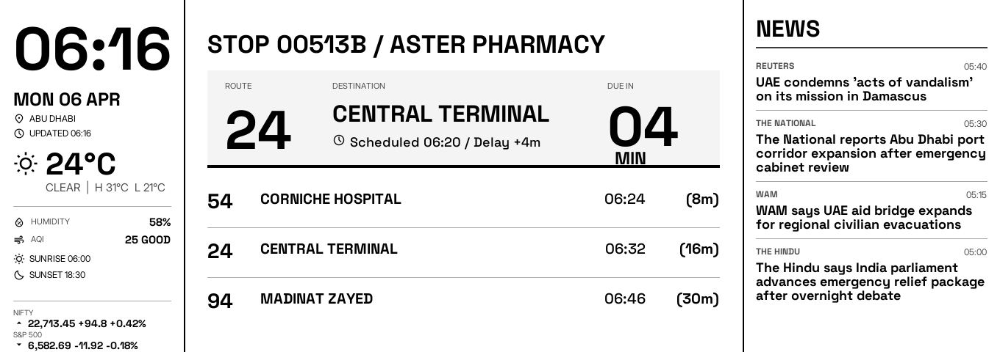
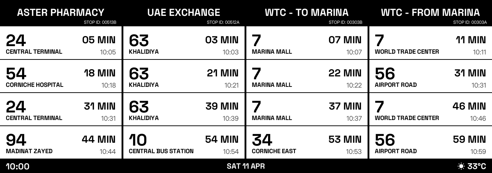
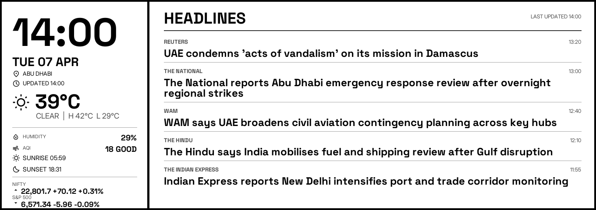

# Abu Dhabi - E-Ink Display

Premium monochrome Abu Dhabi mobility ribbon for `1360x480` e-ink displays.

This repository contains the completed Phase 1 PNG-first implementation for a three-mode mobility display designed around Abu Dhabi bus departures, weather, AQI, curated news headlines, and compact market context. The templates are locked and approved.

## Phase 1 Status

Phase 1 is complete for the product surface:

- locked `weekday_commute_now`, `weekend_multi_stop`, and `ambient_info` templates
- Stitch-export-led design handoff and renderer adaptation
- live Darbi provider with browser/XHR recovery path and stale-board fallback
- weather, AQI, curated headlines, and compact market indices
- scheduler, fixtures, preview transforms, and regression tests

What is intentionally out of scope for Phase 1:

- SPI or panel driver integration
- e-paper hardware refresh control
- Raspberry Pi daemon/service packaging
- on-device deployment automation

## Final Locked Modes

### `weekday_commute_now`

Primary weekday commute board for stop `00513B / Aster Pharmacy`.

- large live departure hero
- three follow-up departures
- persistent utility rail with weather, AQI, solar times, and markets
- editorial news rail



### `weekend_multi_stop`

Four-stop weekend strip with centered stop names and fixed footer.

- `00513B / Aster Pharmacy`
- `00512A / UAE Exchange`
- `00303B / WTC - To Marina`
- `00303A / WTC - From Marina`



### `ambient_info`

Calm editorial off-peak board with a left utility rail and a single-column headline plane.



## Review-Only Comparison Renders

The repo also keeps two review-only comparison previews that simulate an all-delay scenario without changing canonical templates or fixture files:

- `output/frames/weekday_commute_now-all_delayed.png`
- `output/frames/weekend_multi_stop-all_delayed.png`

## Data Sources

- Bus departures: official Darbi web surfaces via MMJPv5, with a Playwright/XHR recovery path and last-good stale fallback
- Weather and AQI: Open-Meteo
- Headlines: curated RSS pipeline with UAE-first ranking and one guaranteed India headline when available
- Markets: NSE NIFTY + Stooq S&P 500

The Darbi live-data root cause and recovery design are documented in [docs/darbi-rca.md](docs/darbi-rca.md).

## Quick Start

```powershell
py -3.11 -m venv .venv
.\.venv\Scripts\python -m pip install --upgrade pip
.\.venv\Scripts\python -m pip install -e .
.\.venv\Scripts\python -m pytest
```

If you want browser-based Darbi fallback support:

```powershell
.\.venv\Scripts\python -m playwright install chromium
```

## Common Commands

Render the three canonical fixture boards:

```powershell
.\.venv\Scripts\mobility-ribbon render-fixture weekday_commute_now
.\.venv\Scripts\mobility-ribbon render-fixture weekend_multi_stop
.\.venv\Scripts\mobility-ribbon render-fixture ambient_info
```

Render a live board using scheduler-selected mode:

```powershell
.\.venv\Scripts\mobility-ribbon render-live
```

Render a specific live mode:

```powershell
.\.venv\Scripts\mobility-ribbon render-live --mode weekday_commute_now
.\.venv\Scripts\mobility-ribbon render-live --mode ambient_info
```

Run the 2-minute demo capture:

```powershell
.\.venv\Scripts\mobility-ribbon demo-run --minutes 2 --sleep-seconds 60
```

## Architecture At A Glance

- `src/ribbon/providers`
  - Darbi live provider
  - Playwright browser/XHR fallback
  - weather, headline, and market providers
- `src/ribbon/derive`
  - normalized snapshot builder and insight derivation
- `src/ribbon/scheduler`
  - mode selection and refresh-hint logic
- `src/ribbon/render`
  - locked monochrome PNG renderer and vendored fonts/icons
- `src/ribbon/preview.py`
  - transient review-only transforms such as uniform delay previews

More detail is in [docs/architecture.md](docs/architecture.md).

## Stitch Handoff

The renderer follows the approved Stitch handoff rather than treating Stitch as loose inspiration.

- project overview and variant history: [docs/design/stitch-directions.md](docs/design/stitch-directions.md)
- current approved handoff package: [design/stitch_exports/12817237892649339225/HANDOFF.md](design/stitch_exports/12817237892649339225/HANDOFF.md)

The curated public repo includes only the approved export set for:

- `584d7fbfd57545489f2288ad975f09cc` (`weekday_commute_now`)
- `0e06961ebc3b4c499e66340a8df937f5` (`weekend_multi_stop`)
- `22afa13267874815a0d5ee96d37e0701` (`ambient_info`)

## Backend / Project Status

No backend redesign is required to consider Phase 1 complete.

The current provider/scheduler stack is sufficient for public release, with these caveats:

- Darbi remains a live web dependency and therefore operationally brittle compared with a formal public API
- current settings are code-configured rather than env/config-file driven
- persistent device runtime and hardware integration are intentionally deferred

Phase 2 is optional and mainly about hardware deployment and production hardening, not template work. See [docs/phase-status.md](docs/phase-status.md).

## Tests

The repository includes coverage for:

- provider normalization and fallback behavior
- scheduler mode selection and refresh timing
- locked render regressions
- review preview transforms
- exact `1360x480` output sizing

Run all tests:

```powershell
.\.venv\Scripts\python -m pytest
```

## Repository Policy

This public repo intentionally includes:

- code
- tests
- release-grade documentation
- final approved preview PNGs
- curated Stitch handoff artifacts

It intentionally excludes:

- bulk demo-run folders
- cache output
- most exploratory/intermediate render artifacts

## License

This project is licensed under the GNU Affero General Public License v3.0. See [LICENSE](LICENSE).

## Change History

See [CHANGELOG.md](CHANGELOG.md).
